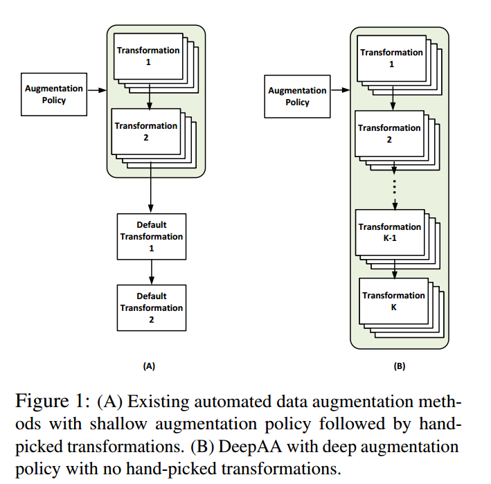
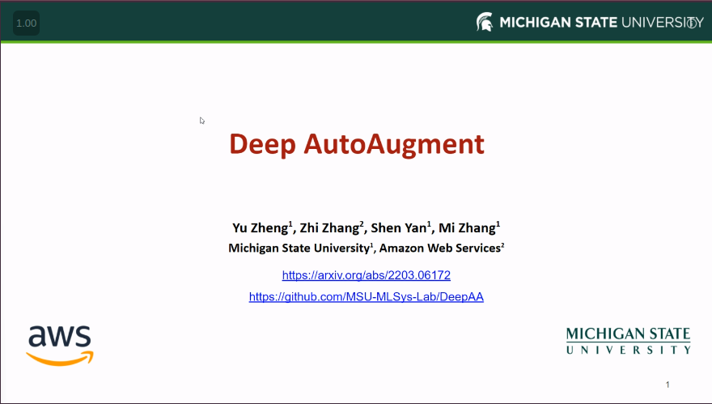

# Deep AutoAugment

This is the official implementation of Deep AutoAugment ([DeepAA](https://openreview.net/forum?id=St-53J9ZARf)), a fully automated data augmentation policy search method. Leaderboard is here: https://paperswithcode.com/paper/deep-autoaugment-1

<p align="center">
   <br />
</p>

## 5-Minute Explanation Video
Click the figure to watch this short video explaining our work.

[](https://recorder-v3.slideslive.com/#/share?share=64177&s=6d93977f-2a40-436d-a404-8808aee650fa)

## Requirements
DeepAA is implemented using TensorFlow. 
To be consistent with previous work, we run the policy evaluation based on [TrivialAugment](https://github.com/automl/trivialaugment), which is implemented using PyTorch.

### Install required packages
a. Create a conda virtual environment.
```shell
conda create -n deepaa python=3.7
conda activate deepaa
```

b. Install Tensorflow and PyTorch.
```shell
conda install tensorflow-gpu=2.5 cudnn=8.1 cudatoolkit=11.2 -c conda-forge
pip3 install torch==1.9.0+cu111 torchvision==0.10.0+cu111 -f https://download.pytorch.org/whl/torch_stable.html
```

c. Install other dependencies.
```shell
pip install -r requirements.txt
```


## Experiments

### Run augmentation policy search on CIFAR-10/100. 
```shell
export CUDA_VISIBLE_DEVICES=0,1,2,3,4,5,6,7
python DeepAA_search.py --dataset cifar10 --n_classes 10 --use_model WRN_40_2 --n_policies 6 --search_bno 1024 --pretrain_lr 0.1 --seed 1 --batch_size 128 --test_batch_size 512 --policy_lr 0.025 --l_mags 13 --use_pool --pretrain_size 5000 --nb_epochs 45 --EXP_G 16 --EXP_gT_factor=4 --train_same_labels 16
```

### Run augmentation policy search on ImageNet.
```shell
mkdir pretrained_imagenet
```
Download the [files](https://drive.google.com/drive/folders/1QmqWfF_dzyZPDIuvkiLHp0X6JiUNbIZI?usp=sharing) and copy them to the `./pretrained_imagenet` folder.
```shell
export CUDA_VISIBLE_DEVICES=0,1,2,3,4,5,6,7
python DeepAA_search.py --dataset imagenet --n_classes 1000 --use_model resnet50 --n_policies 6 --search_bno 1024 --seed 1 --batch_size 128 --test_batch_size 512 --policy_lr 0.025 --l_mags 13 --use_pool --EXP_G 16 --EXP_gT_factor=4 --train_same_labels 16
```

### Evaluate the policy found on CIFAR-10/100 and ImageNet. 
```shell
mkdir ckpt
python -m DeepAA_evaluate.train -c confs/wresnet28x10_cifar10_DeepAA_1.yaml --dataroot ./data --save ckpt/DeepAA_cifar10.pth --tag Exp_DeepAA_cifar10
python -m DeepAA_evaluate.train -c confs/wresnet28x10_cifar100_DeepAA_1.yaml --dataroot ./data --save ckpt/DeepAA_cifar100.pth --tag Exp_DeepAA_cifar100
python -m DeepAA_evaluate.train -c confs/resnet50_imagenet_DeepAA_8x256_1.yaml --dataroot ./data --save ckpt/DeepAA_imagenet.pth --tag Exp_DeepAA_imagenet
```

### Evaluate the policy found on CIFAR-10/100 with Batch Augmentation.
```shell
mkdir ckpt
python -m DeepAA_evaluate.train -c confs/wresnet28x10_cifar10_DeepAA_BatchAug8x_1.yaml --dataroot ./data --save ckpt/DeepAA_cifar10.pth --tag Exp_DeepAA_cifar10
python -m DeepAA_evaluate.train -c confs/wresnet28x10_cifar100_DeepAA_BatchAug8x_1.yaml --dataroot ./data --save ckpt/DeepAA_cifar100.pth --tag Exp_DeepAA_cifar100
```

## Visualization

The policies found on CIFAR-10/100 and ImageNet are visualized as follows.

<p align="center">
   <br />
</p>

The distribution of operations at each layer of the policy for (a) CIFAR-10/100 and (b) ImageNet. The probability of each operation is summed up over all 12 discrete intensity levels of the corresponding transformation.

<p align="center">
   <br />
</p>

The distribution of discrete magnitudes of each augmentation transformation in each layer of the policy for CIFAR-10/100. The x-axis represents the discrete magnitudes and the y-axis represents the probability. The magnitude is discretized to 12 levels with each transformation having its own range. A large absolute value of the magnitude corresponds to high transformation intensity. Note that we do not show identity, autoContrast, invert, equalize, flips, Cutout and crop because they do not have intensity parameters.

<p align="center">
   <br />
</p>

The distribution of discrete magnitudes of each augmentation transformation in each layer of the policy for ImageNet. The x-axis represents the discrete magnitudes and the y-axis represents the probability. The magnitude is discretized to 12 levels with each transformation having its own range. A large absolute value of the magnitude corresponds to high transformation intensity. Note that we do not show identity, autoContrast, invert, equalize, flips, Cutout and crop because they do not have intensity parameters.

## Citation
If you find this useful for your work, please consider citing:
```
@InProceedings{yu2022deepaa,
  title = {Deep AutoAugmentation},
  author = {Zheng, Yu and Zhang, Zhi and Yan, Shen and Zhang, Mi},
  booktitle = {ICLR},
  year = {2022}
}
```
